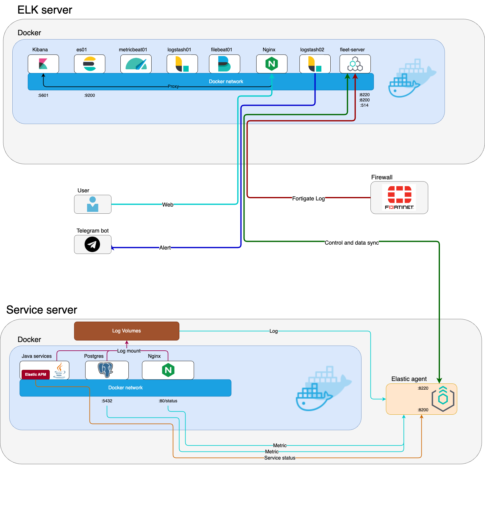

# HIS-ELK-weekly-report

This is a Python-based project for automatically requesting, analyzing, and visualizing data from the ELK (Elasticsearch, Logstash, Kibana) stack integrated with a Hospital Information System (HIS). This project aims to streamline the process of data retrieval and visualization to facilitate weekly reporting.

## Table of Contents
- [HIS-ELK System structure](#his-elk-system-structure)
- [Features](#features)
- [Installation](#installation)
- [Usage](#usage)
- [Configuration](#configuration)
- [Contributing](#contributing)
- [License](#license)

## HIS-ELK System structure


The above diagram illustrates the system architecture of the HIS-ELK integration, showcasing how data flows from the Hospital Information System through Logstash, is indexed in Elasticsearch, and finally visualized in Kibana.

## Features
- **Automated Data Requests:** Periodically requests data from the ELK stack.
- **Data Processing:** Cleans and processes the data for analysis.
- **Visualization:** Generates visual reports and dashboards using Kibana.
- **Scheduling:** Automates the report generation process on a weekly basis.

## Installation
1. **Clone the repository:**
    ```bash
    git clone https://github.com/yourusername/HIS-ELK-weekly-report.git
    cd HIS-ELK-weekly-report
    ```

2. **Create and activate a virtual environment:**
    ```bash
    python3 -m venv venv
    source venv/bin/activate  # On Windows use `venv\Scripts\activate`
    ```

3. **Install the required dependencies:**
    ```bash
    pip install -r requirements.txt
    ```

## Usage
1. **Configure your ELK connection settings in the `.env` file:**
    ```env
    ELASTICSEARCH_API_KEY="your elasticsearch api key"
    ELASTICSEARCH_URL="https://localhost:9200"
    JSON_TEMPLATE_PATH="./api-json-template/"
    ```
2. **Add new request json**
    json file is in ./api-json-template/
    and you can easy to get kibana json request by 
    1. go to dashboard witch you want
    2. click edit on the top right
    3. click setting icon on panel withch you want
    4. click more and click Inspect 
    5. click View: Data on the top right change to Requests
    6. click Request and copy it 
    7. change host.name to this_should_be_server_hostname
              gte to this_should_be_start_time
              lte to this_should_be_end_time
    8. rename it and save to ./api-json-template/


3. **Run the data retrieval and report generation script:**
    ```bash
    python 
    ```

## Configuration
- **ELK Settings:** Update the `.env` file with your ELK stack credentials and settings.

## Contributing
We welcome contributions to improve this project! Please fork the repository and create a pull request with your changes.

## License
This project is licensed under the MIT License. See the [LICENSE](LICENSE) file for details.
